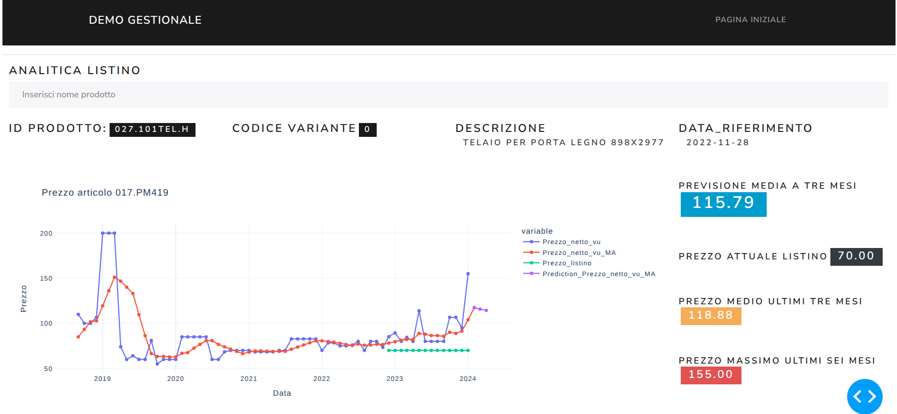
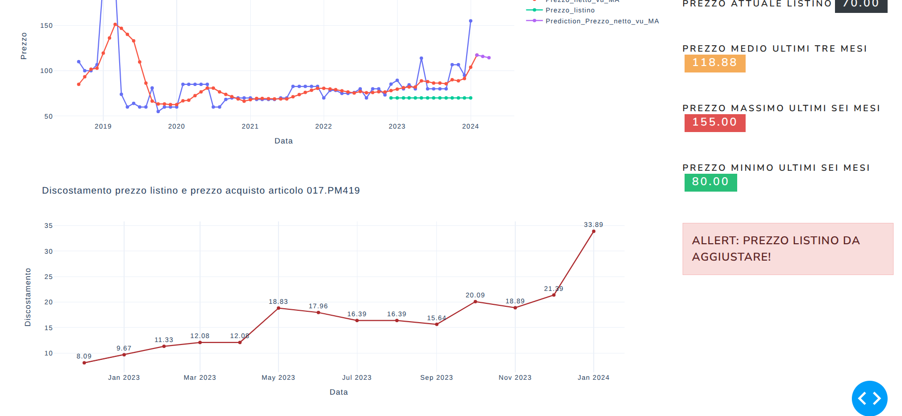
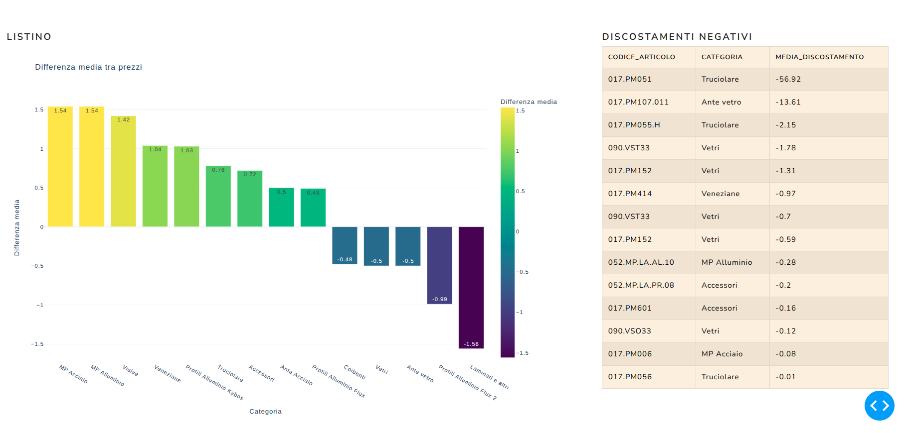
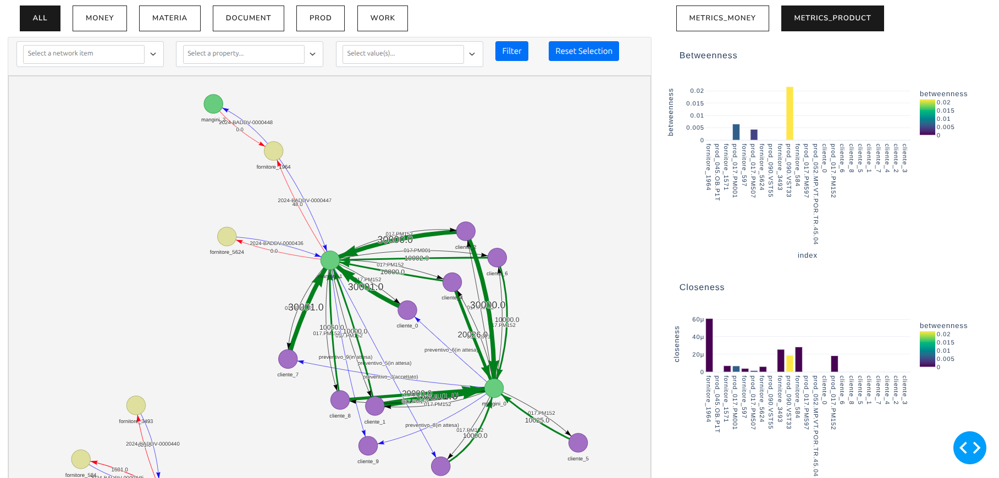
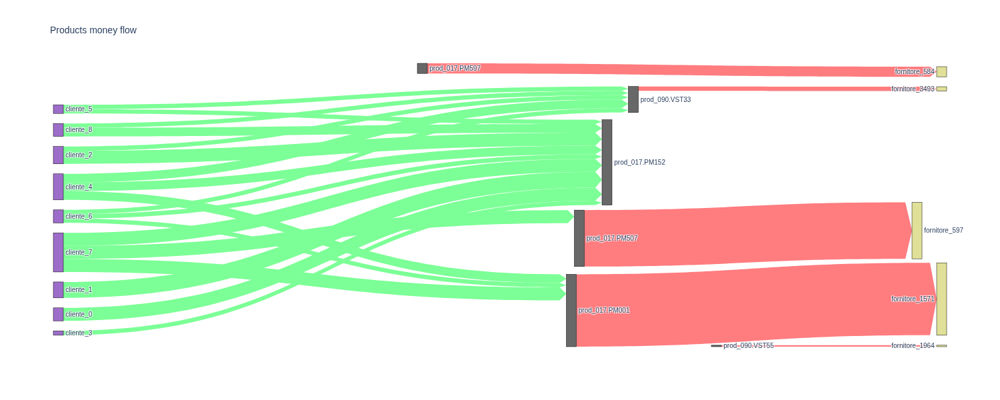

# Sales Data Analysis and Price List Management System (DEMO)

## 📋 Project Overview

This project represents a comprehensive data analysis and business intelligence system designed to analyze **DDT (Documenti di Trasporto)** - Italian mandatory transport documents - and create intelligent price lists (**Listino**) for sales management. The system includes data preprocessing, analysis, visualization, and a web-based dashboard for business insights.

### ⚠️ Project Status

While the project successfully demonstrates advanced data processing and analysis capabilities, it was eventually **discontinued due to ID code mismatches** between different data sources. However, the prototyping work remains valuable for understanding sales data analysis methodologies and business intelligence implementation.

### 🔒 Data Privacy Notice

**All data used in this project has been falsified and completely anonymized** to protect sensitive business information. The dataset includes:

- **Synthetic product codes** and descriptions
- **Anonymized supplier information**
- **Generated transaction data** that maintains statistical properties while ensuring privacy
- **Fake customer and company identifiers**

This ensures the project can be shared publicly while demonstrating real-world data analysis techniques without compromising actual business data.

## 🎯 Project Objectives

1. **Data Integration**: Consolidate sales transaction data (DDT) with product cost information (ART_COSTI)
2. **Price Analysis**: Analyze price discrepancies and trends between actual sales and price lists
3. **Business Intelligence**: Provide insights through interactive dashboards and visualizations
4. **Price List Generation**: Create optimized price lists based on historical sales data
5. **Network Analysis**: Understand product relationships and sales flow patterns

## 📁 Project Structure

```text
LISTINO_DDT/
│
├── 📊 Data Processing Notebooks
│   ├── preprocessing_DDT.ipynb           # DDT data cleaning and standardization
│   ├── preprocessing_listino.ipynb      # Price list data preprocessing
│   ├── preprocessing_global.ipynb       # Global data integration
│   └── create_listino.ipynb            # Price list generation algorithms
│
├── 🔍 Analysis Notebooks
│   ├── vista_listino.ipynb             # Price list analysis and visualization
│   ├── vista_ddt.ipynb                 # DDT transaction analysis
│   ├── vista_ddt_CODICI.ipynb          # Product code analysis
│   ├── vista_ddt_CODICI_no_var.ipynb   # Product analysis without variants
│   └── graph-flow_analysis.ipynb       # Network flow analysis
│
├── 🌐 Web Dashboard
│   ├── dash_app/
│   │   ├── app.py                       # Main Dash application
│   │   ├── pages/                       # Dashboard pages
│   │   │   ├── listino.py              # Price list management
│   │   │   ├── ddt.py                  # DDT analysis dashboard
│   │   │   ├── grafi.py                # Graph visualizations
│   │   │   ├── analisi_listino.py      # Price list analytics
│   │   │   ├── preventivo.py           # Quote management
│   │   │   └── permessi.py             # User permissions
│   │   ├── db/                         # Database files
│   │   ├── grafi/                      # Graph visualizations
│   │   ├── listino/                    # Price list data
│   │   └── permessi/                   # User permission schemas
│
├── 📦 Data Directories
│   ├── data_raw/                       # Original data files
│   │   ├── dbo_DDT_FOR_RIGHE.xlsx     # Raw DDT transaction data
│   │   ├── dbo_ART_COSTI.xlsx         # Raw product cost data
│   │   └── Aggiornamento_ART_COSTI_per_tipo_articoli_21-08_2023.xlsx
│   ├── data_clean/                     # Processed data
│   ├── data_generated/                 # Synthetic/generated data
│   └── data_demo/                      # Demo data for testing
│
├── 📈 Analysis Results
│   ├── vista_listino/                  # Price list analysis outputs
│   └── graph_analysis/                 # Network analysis results
│
└── 📋 Configuration
    ├── requirements.txt                 # Python dependencies
    ├── dict_entities.json              # Entity dictionary
    └── schema_permessi_utente.csv       # User permission schema
```

## 🔧 Technologies Used

### Core Technologies

- **Python 3.x** - Main programming language
- **Pandas & NumPy** - Data manipulation and analysis
- **Plotly & Matplotlib** - Data visualization
- **Dash & Dash Bootstrap Components** - Web dashboard framework
- **NetworkX & PyVis** - Network analysis and visualization
- **Scikit-learn** - Machine learning and clustering
- **Jupyter Notebooks** - Interactive data analysis

### Key Libraries

```python
dash==2.16.1
pandas==2.2.1
plotly==5.20.0
networkx==3.2.1
scikit-learn==1.4.1.post1
dash-bootstrap-components==1.5.0
pyvis==0.3.2
seaborn==0.13.2
```

## 📊 Data Sources and Structure

### Primary Data Sources

1. **DDT_FOR_RIGHE** (Transport Document Lines)
   - Supplier information (`COD_CF_Fornitore`)
   - Document metadata (`Data_documento`, `ID_documento`)
   - Product details (`Codice_articolo`, `Codice_variante`)
   - Pricing (`Prezzo_netto_vu`, `importo`)
   - Quantities and units (`Quantita_um`, `Unita_misura`)

2. **ART_COSTI** (Article Costs)
   - Product codes (`Codice_articolo`, `Codice_variante`)
   - Cost information (`Costo`)
   - Reference dates (`Data_riferimento`)
   - Product categories and descriptions

### Key Data Processing Steps

1. **Data Cleaning**
   - Removal of empty columns and rows
   - Data type standardization
   - Missing value handling
   - Column renaming for consistency

2. **Data Integration**
   - Merging DDT and cost data on product codes
   - Handling variant mismatches
   - Creating unified product catalogs

3. **Feature Engineering**
   - Price discrepancy calculations
   - Moving averages for trend analysis
   - Category-based groupings
   - Time series transformations

## 🔍 Core Analysis Features

### 1. Price List Analysis (`vista_listino.ipynb`)

- **Price Trend Analysis**: Historical price evolution tracking
- **Clustering**: Product grouping based on pricing patterns
- **PCA Analysis**: Dimensionality reduction for pattern identification
- **Discrepancy Detection**: Identification of pricing anomalies
- **Moving Averages**: Trend smoothing and prediction


---

---


### 2. DDT Transaction Analysis (`vista_ddt.ipynb`)

- **Sales Volume Analysis**: Transaction frequency and volume tracking
- **Supplier Analysis**: Performance metrics by supplier
- **Product Performance**: Best/worst selling products
- **Time Series Analysis**: Seasonal patterns and trends



### 3. Network Flow Analysis (`graph-flow_analysis.ipynb`)

- **Product Relationship Mapping**: Understanding product interdependencies
- **Sankey Diagrams**: Visual flow representation of sales processes
- **Network Metrics**: Centrality measures and clustering coefficients
- **Flow Optimization**: Identifying bottlenecks and opportunities


---


### 4. Code Matching Analysis (`vista_ddt_CODICI.ipynb`)

- **Product Code Reconciliation**: Identifying matching issues
- **Variant Analysis**: Understanding product variations
- **Data Quality Assessment**: Measuring data consistency
- **Mapping Algorithms**: Fuzzy matching for code resolution

## 🌐 Web Dashboard Features

### User Interface Components

- **Navigation**: Multi-page navigation with role-based access
- **Data Tables**: Interactive tables with sorting and filtering
- **Charts**: Dynamic Plotly visualizations
- **Controls**: Date pickers, dropdowns, and filters
- **Export**: Data export capabilities

### Dashboard Pages

1. **Price List Management** (`listino.py`)
   - Price list visualization and editing
   - Clustering analysis display
   - Price deviation tracking

2. **DDT Analysis** (`ddt.py`)
   - Transaction monitoring
   - Supplier performance metrics
   - Volume analysis

3. **Graph Visualizations** (`grafi.py`)
   - Network diagrams
   - Flow charts
   - Relationship mappings

4. **Analytics Dashboard** (`analisi_listino.py`)
   - Comprehensive price analysis
   - Statistical summaries
   - Trend predictions

5. **User Management** (`permessi.py`)
   - Role-based access control
   - Permission management

## 🔐 Security and Permissions

The system implements a role-based access control system:

```csv
Role        | Read | Create | Update | Delete
------------|------|--------|--------|--------
SuperAdmin  |  ✓   |   ✓    |   ✓    |   ✓
Admin       |  ✓   |   ✓    |   ✓    |   ✗
Manager     |  ✓   |   ✓    |   ✓    |   ✗
User        |  ✓   |   ✓    |   ✓    |   ✓
```

## 🚀 Installation and Setup

### Prerequisites

- Python 3.8+
- pip package manager

### Installation Steps

1. **Clone the repository**

   ```bash
   git clone <repository-url>
   cd LISTINO_DDT
   ```

2. **Install dependencies**

   ```bash
   pip install -r requirements.txt
   ```

3. **Prepare data**
   - Place raw data files in `data_raw/`
   - Run preprocessing notebooks in order:

     ```bash
     jupyter notebook preprocessing_DDT.ipynb
     jupyter notebook preprocessing_listino.ipynb
     jupyter notebook preprocessing_global.ipynb
     ```

4. **Run the dashboard**

   ```bash
   python dash_app/app.py
   ```

5. **Access the application**
   - Open browser to `http://localhost:8050`

## 📈 Analysis Workflow

### 1. Data Preprocessing

```text
Raw Data → Cleaning → Standardization → Integration → Clean Data
```

### 2. Exploratory Analysis

```text
Clean Data → Statistical Analysis → Visualization → Pattern Recognition
```

### 3. Advanced Analytics

```text
Patterns → Clustering → Network Analysis → Predictive Modeling
```

### 4. Reporting

```text
Analysis Results → Dashboard → Business Insights → Decision Support
```

## ⚠️ Known Issues and Limitations

### Primary Challenge: ID Code Mismatches

The project encountered significant challenges with **inconsistent product ID coding** between different data sources:

- **DDT data** used one coding scheme
- **Article cost data** used a different coding scheme  
- **Variant handling** was inconsistent across systems
- **Manual reconciliation** proved too time-intensive

### Technical Limitations

1. **Data Quality**: Inconsistent data entry across source systems
2. **Performance**: Large dataset processing can be memory-intensive
3. **Real-time Updates**: Current system requires manual data refresh
4. **Scalability**: Dashboard performance degrades with very large datasets

### Business Impact

While the technical solution was robust, the **data integration challenges** made the system impractical for production use without significant data standardization efforts.

## 🔮 Potential Future Improvements

If the project were to be resumed, key improvements would include:

1. **Data Standardization**
   - Implement unified product coding system
   - Create automated data validation pipelines
   - Develop fuzzy matching algorithms for code reconciliation

2. **Real-time Processing**
   - Connect to live data sources
   - Implement streaming data processing
   - Add automated anomaly detection

3. **Enhanced Analytics**
   - Machine learning price prediction models
   - Automated clustering and segmentation
   - Advanced forecasting capabilities

4. **User Experience**
   - Mobile-responsive design
   - Advanced filtering and search
   - Customizable dashboards

## 📚 Learning Outcomes

This project demonstrates proficiency in:

- **Data Engineering**: Complex ETL processes and data integration
- **Business Intelligence**: Dashboard development and visualization
- **Data Science**: Statistical analysis, clustering, and network analysis
- **Web Development**: Full-stack dashboard application
- **Project Management**: Handling real-world data challenges and constraints

## 📄 License

This project was developed for internal business use and serves as a demonstration of data analysis and business intelligence capabilities.

---

**Note**: This project represents significant effort in data analysis and business intelligence development, even though it was ultimately discontinued due to data integration challenges. The methodologies and technical implementations remain valuable for similar projects with better data standardization.
